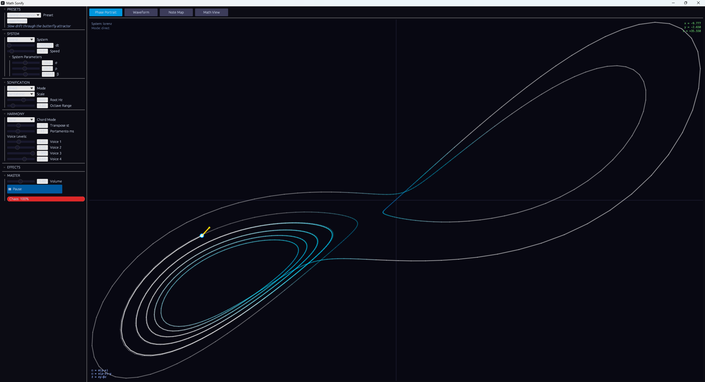
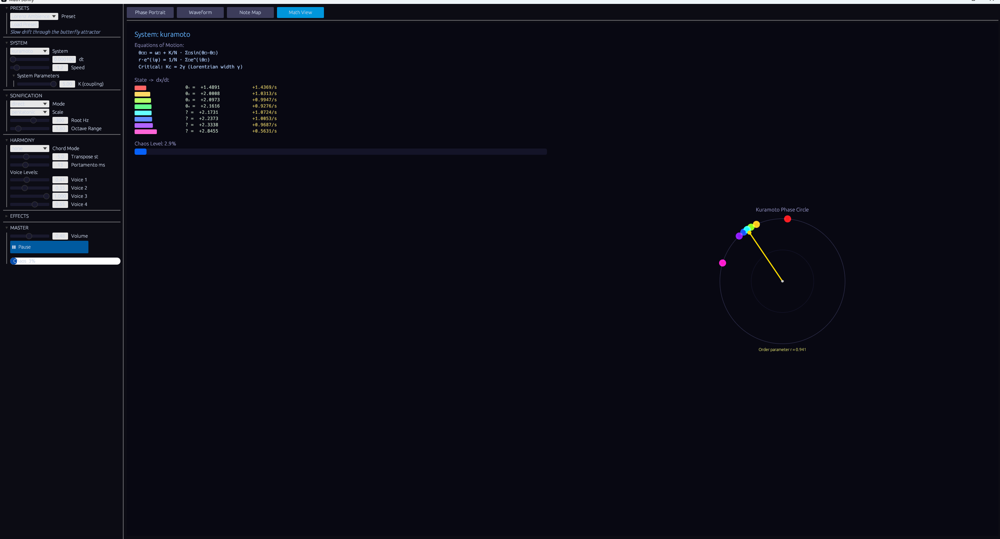
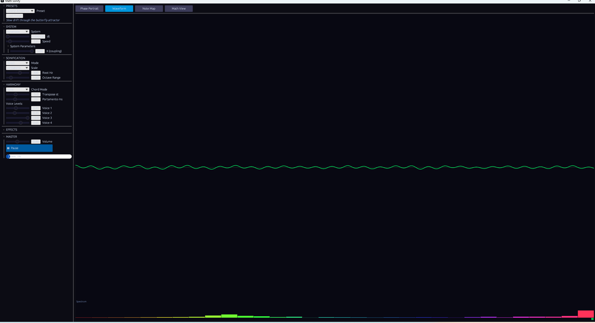

# Math Sonify 🎵

> **Real-time procedural audio from mathematical dynamical systems.**
> The math drives the music. You hear the actual dynamics - chaos, synchronization, orbital resonance - translated directly into sound.



---

## What is this?

Math Sonify runs continuous simulations of mathematical systems - strange attractors, coupled oscillators, gravitational problems, geodesic flows - and maps their evolving state to sound in real time. It's not data sonification in the generic sense. The actual differential equations are running, and what you hear *is* the math.

Crank up the coupling constant on the Kuramoto oscillators and listen to synchronization emerge. Drop the Lorenz system into a chaotic regime and hear the butterfly attractor spiral through pitch space. Watch the three-body figure-8 orbit in phase space while its near-periodic rhythm plays out in audio.

---

## Screenshots

### Lorenz Attractor - Phase Portrait
The butterfly attractor traced in real time. Color encodes trajectory speed (deep blue → cyan → white). The gold arrow shows the current velocity vector (dx/dt). Equations visible bottom-left, live state values top-right.


### Kuramoto Oscillators - Math View
8 coupled phase oscillators shown on a unit circle. The gold arrow is the order parameter - watch it grow as you raise the coupling constant K, showing the synchronization phase transition live.



### Waveform + Spectrum
Neon green oscilloscope with 32-bin DFT spectrum below. RMS level bar on the right edge.



---

## Get Started (Windows)

### Option A - Run the prebuilt executable (no install needed)

1. Download [`math-sonify.exe`](release/math-sonify.exe) and [`config.toml`](release/config.toml)
2. Put both files in the **same folder**
3. Double-click `math-sonify.exe`
4. Sound starts immediately - Lorenz attractor, pentatonic scale, direct mapping

> **Note:** Windows may show a SmartScreen warning since the exe isn't signed. Click **"More info" → "Run anyway"**.

### Option B - Build from source

Requires [Rust](https://rustup.rs/) (stable, 1.75+).

```bash
git clone https://github.com/Mattbusel/math-sonify
cd math-sonify
cargo run --release
```

---

## Dynamical Systems

| System | Dimension | Integrator | Character |
|--------|-----------|------------|-----------|
| **Lorenz** | 3D | RK4 | Chaotic butterfly, sensitive to σ/ρ/β |
| **Rössler** | 3D | RK4 | Slower spiral chaos, more melodic |
| **Double Pendulum** | 4D | Symplectic (Störmer-Verlet) | Chaotic with quasi-periodic musical regimes |
| **Geodesic Torus** | 4D | RK4 | Irrational winding → ergodic drone |
| **Kuramoto** | 8D | RK4 | Synchronization transition: noise → harmony |
| **Three-Body** | 12D | Symplectic | Figure-8 orbit, gravitational rhythm |

---

## Sonification Modes

| Mode | How it works |
|------|-------------|
| **Direct** | State variables → quantized oscillator frequencies on a musical scale |
| **Orbital** | Instantaneous angular velocity = fundamental; Lyapunov exponent → inharmonicity |
| **Granular** | Trajectory speed → grain density; position → grain pitch |
| **Spectral** | State vector → additive spectral envelope (32 partials) |

---

## Controls

**Left panel:**
- **PRESETS** - 6 named starting points: Lorenz Ambience, Pendulum Rhythm, Torus Drone, Kuramoto Sync, Three-Body Jazz, Rössler Drift
- **SYSTEM** - selector + per-system parameters (σ, ρ, β for Lorenz etc.)
- **SONIFICATION** - mode, scale (pentatonic / chromatic / just intonation / microtonal), root frequency, octave range
- **HARMONY** - chord voicings (major / minor / power / dom7 / sus2 / octave), transpose (±24 semitones), portamento, per-voice mix
- **EFFECTS** - reverb wet/dry, delay time + feedback
- **MASTER** - volume, pause, live chaos meter

**Visualization tabs:**
- **Phase Portrait** - glowing fading trail + velocity arrow + equations overlay + live state values
- **Waveform** - oscilloscope + 32-bin spectrum
- **Note Map** - log-frequency axis showing voice pitches and chord tones as note names
- **Math View** - equations, live state vector vs. derivative, Kuramoto phase circle, chaos gauge

---

## Musical Tips

**Making ambient pads:** Load *Torus Drone* → raise reverb to 0.65 → set portamento to 400ms → switch chord to Major. The geodesic winding produces slow, consonant drifts.

**Hearing synchronization happen:** Load *Kuramoto Sync* → set coupling K to 0.5 (incoherent noise) → slowly drag K up to 3.0 → listen as the tones lock into harmony. That's the Kuramoto phase transition in real time.

**Chaotic rhythm:** Load *Pendulum Rhythm* → set mode to Granular → increase speed to 3.0. The grain density tracks trajectory speed - chaotic phases sound dense, near-periodic passages pulse rhythmically.

**Jazz voicings from chaos:** Load *Three-Body Jazz* → Spectral mode → Dom7 chord → just intonation scale. The near-periodic figure-8 orbit produces repeating harmonic structures with occasional chaotic departures.

---

## Config File

`config.toml` in the same directory as the exe is loaded at startup. Edit it to change defaults. All parameters match the UI sliders.

```toml
[system]
name = "lorenz"   # lorenz | rossler | double_pendulum | geodesic_torus | kuramoto | three_body
dt = 0.001
speed = 1.0

[sonification]
mode = "direct"         # direct | orbital | granular | spectral
scale = "pentatonic"    # pentatonic | chromatic | just_intonation | microtonal
base_frequency = 220.0
octave_range = 3.0
chord_mode = "none"     # none | major | minor | power | sus2 | octave | dom7
transpose_semitones = 0.0
portamento_ms = 80.0

[audio]
reverb_wet = 0.4
delay_ms = 300.0
master_volume = 0.7
```

---

## Architecture

```
Simulation thread (120 Hz)          Audio thread (44100/48000 Hz)
─────────────────────────           ─────────────────────────────
DynamicalSystem::step()      ──▶    crossbeam channel
  └─ RK4 / Symplectic                 └─ SynthState::render()
Sonification::map()                      ├─ 4 sine voices + 3 chord voices
  └─ state → AudioParams                 ├─ Freeverb reverb
                                         ├─ Delay line
UI thread (30 Hz)                        └─ Lookahead limiter
─────────────
egui panels + painters
  └─ phase portrait, waveform,
     note map, math view
```

- No allocations or locks in the audio callback
- All sim→audio communication via `crossbeam_channel` (non-blocking `try_send`)
- Waveform capture via `parking_lot::Mutex::try_lock()` (skips on contention, no audio glitch)

---

## Built with

- [Rust](https://www.rust-lang.org/)
- [cpal](https://github.com/RustAudio/cpal) - cross-platform audio I/O
- [egui](https://github.com/emilk/egui) / [eframe](https://github.com/emilk/egui/tree/master/crates/eframe) - immediate-mode GUI
- [crossbeam-channel](https://github.com/crossbeam-rs/crossbeam) - lock-free inter-thread communication
- [parking_lot](https://github.com/Amanieu/parking_lot) - fast mutexes
- [serde](https://serde.rs/) + [toml](https://docs.rs/toml) - config parsing

---

## License

MIT

---

`#rust` `#audio` `#generativemusic` `#chaostheory` `#dynamicalsystems` `#sounddesign` `#procedural` `#mathmusic` `#lorenz` `#kuramoto` `#ambientmusic` `#creativecoding` `#dsp` `#physics` `#strangeattractors`
